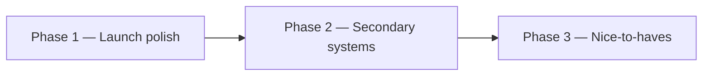

# Poker Faces — product roadmap

Play-money Texas Hold’em for friends. Virtual chips only. This roadmap is the sequenced product plan after the current shipped core.

## 1. Current state (shipped)

- [x] Username/password auth + cookie sessions (PBKDF2)
- [x] Host create / invite / approve–decline join
- [x] Authoritative Hold’em Durable Object (blinds, streets, pot-cap, side pots, timers, privacy)
- [x] Table UX (share invite, street/timer, winners, host rules, chat)
- [x] Archive write path (Queue → D1 + R2)
- [x] PWA shell + branded home guidance
- [x] Staging/production Cloudflare deploy via GitHub Actions

## 2. Partial / known gaps

- **Voice** — Server can provision a RealtimeKit meeting + participant token (`worker/voice/realtimekit.ts`). UI is token-only: `VoicePanel` does not join a RealtimeKit session yet. Client join work may be in flight on a separate PR; keep this gap until that lands on `main`.
- **Turnstile** — Server verifies on register/login when `TURNSTILE_SECRET_KEY` is set. No client widget; join accepts an optional token but never verifies it.
- **Reconnect** — Clients rely on DO snapshot only. `room_events` table exists in the DO but is unused (dead path).
- **Leave table** — UI navigates home; `room_members` / DO seat are not cleared.
- **Missing product surfaces** — No rebuy / stack reset, no hand-history UI, no “my tables” lobby list.
- **CONFIG_KV** — Bound in Wrangler; unused for flags/copy.

## 3. Three-phase roadmap

### Phase 1 — Launch polish

1. [ ] Turnstile widget on register/login; enforce on join when secret is set
2. [ ] Leave / stand-up + host kick (clear `room_members` + DO seat)
3. [ ] Play-money rebuy / stack reset for busted seats
4. [ ] Reconnect hardening: persist room events **or** document snapshot-only and stop creating dead `room_events`
5. [ ] Between-hand UX: clearer waiting / deal state (auto-deal out of scope for Phase 1)
6. [ ] Minimal e2e smoke: create → join → approve → one hand

### Phase 2 — Secondary systems

1. [ ] RealtimeKit client join in `VoicePanel` (game path stays independent of voice)
2. [ ] Hand history API + simple UI from D1/R2
3. [ ] “My tables” lobby list for host/member rooms
4. [ ] `CONFIG_KV` for non-authoritative flags/copy
5. [ ] Seat picker on approve; richer Analytics events
6. [ ] Drop or migrate unused WebAuthn tables

### Phase 3 — Nice-to-haves

1. [ ] Full hand replay viewer
2. [ ] Richer PWA/offline shell
3. [ ] Spectator / away presence without breaking timers
4. [ ] Optional passkeys alongside passwords
5. [ ] Table themes / avatars

## 4. Explicit non-goals

- No real-money language, wallets, purchases, rake, or cash-out
- Server remains sole card/pot authority; never leak foreign hole cards

## Related docs

- [`GAME_RULES.md`](./GAME_RULES.md) — play-money rules and privacy
- [`ARCHITECTURE.md`](./ARCHITECTURE.md) — Worker / DO / D1 layout
- [`GITHUB_ACTIONS_DEPLOY.md`](./GITHUB_ACTIONS_DEPLOY.md) — staging/production deploy
- [`BRAND_GUIDE.md`](./BRAND_GUIDE.md) — brand and copy
