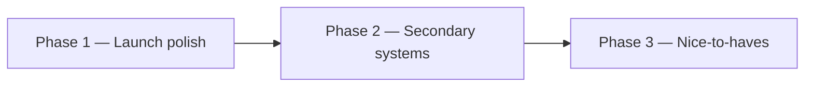

# Poker Faces — product roadmap

Play-money Texas Hold’em for friends. Virtual chips only. This roadmap is the sequenced product plan after the current shipped core.

## 1. Current state (shipped)

- [x] Username/password auth + cookie sessions (PBKDF2)
- [x] Optional GitHub + Google OAuth (authorization code + linked accounts)
- [x] Host create / invite / approve–decline join
- [x] Authoritative Hold’em Durable Object (blinds, streets, pot-cap, side pots, timers, privacy)
- [x] Table UX (share invite, street/timer, winners, host rules, chat)
- [x] Archive write path (Queue → D1 + R2)
- [x] PWA shell + branded home guidance
- [x] Staging/production Cloudflare deploy via GitHub Actions
- [x] Host can seat practice bots in open seats (DO auto-acts)

## 2. Partial / known gaps

- **Passkeys** — Password auth is shipped; optional WebAuthn/passkeys alongside passwords are deferred (tables dropped in migration `0006`).
- **Auto-deal** — Explicitly out of scope; host still deals each hand (ask-host-to-start helps between hands).

## 3. Three-phase roadmap

### Phase 1 — Launch polish

1. [x] Auth rate limits on register/login/guest/join (Turnstile removed)
2. [x] Leave / stand-up + host kick (clear `room_members` + DO seat)
3. [x] Play-money rebuy / stack reset for busted seats
4. [x] Reconnect hardening: document snapshot-only and stop creating dead `room_events`
5. [x] Between-hand UX: clearer waiting / deal state (auto-deal out of scope for Phase 1)
6. [x] Minimal e2e smoke: create → join → approve → one hand

### Phase 2 — Secondary systems

1. [x] RealtimeKit client join in `VoicePanel` (game path stays independent of voice)
2. [x] Hand history API + simple UI from D1/R2
3. [x] “My tables” lobby list for host/member rooms
4. [x] `CONFIG_KV` for non-authoritative flags/copy
5. [x] Seat picker on approve; richer Analytics events
6. [x] Drop or migrate unused WebAuthn tables

### Phase 3 — Nice-to-haves

1. [x] Full hand replay viewer
2. [x] Richer PWA/offline shell
3. [x] Spectator / away presence without breaking timers
4. [ ] Optional passkeys alongside passwords (deferred — WebAuthn tables dropped; reintroduce later)
5. [x] Table themes / avatars

### Poker Now parity (Hold’em-only)

See [`POKERNOW_PARITY.md`](./POKERNOW_PARITY.md).

1. [x] Guest join via invite (display name + short guest session)
2. [x] Session ledger + CSV
3. [x] Host pause / resume
4. [x] Time bank
5. [x] True spectator (approve as watch-only)
6. [x] Host transfer + close table
7. [x] Max seats 10, bigger cards, rabbit hunt
8. [ ] Ante / live straddle (deferred)

## 4. Explicit non-goals

- No real-money language, wallets, purchases, rake, or cash-out
- Server remains sole card/pot authority; never leak foreign hole cards

## Related docs

- [`GAME_RULES.md`](./GAME_RULES.md) — play-money rules and privacy
- [`ARCHITECTURE.md`](./ARCHITECTURE.md) — Worker / DO / D1 layout
- [`GITHUB_ACTIONS_DEPLOY.md`](./GITHUB_ACTIONS_DEPLOY.md) — staging/production deploy
- [`BRAND_GUIDE.md`](./BRAND_GUIDE.md) — brand and copy
- [`POKERNOW_PARITY.md`](./POKERNOW_PARITY.md) — guest join, ledger, pause, time bank, spectators
